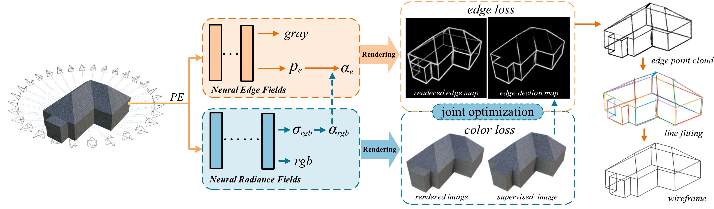

# Edeg-Nerf 

The implementation for the AUTOCON paper [3D wireframe model reconstruction of buildings from multi-view images using neural implicit fields](https://www.sciencedirect.com/science/article/pii/S0926580525001852?dgcid=coauthor)


## Abstract

The 3D wireframe model provides concise structural information for building reconstruction. Traditional geometry-based methods are prone to noise or missing data in 3D data. To address these issues, this
paper introduces Edge-NeRF, a 3D wireframe reconstruction pipeline using neural implicit fields. By leveraging 2D multi-view images and their edge maps as supervision, it enables self-supervised extraction of 3D wireframes, thus eliminating the need for extensive training on large-scale ground-truth 3D wireframes. Edge-NeRF constructs neural radiance fields and neural edge fields to optimize scene appearance and edge structure simultaneously, and then the wireframe model is fitted from coarse to fine based on the extracted 3D edge points. Furthermore, a synthetic multi-view image dataset of buildings with 3D wireframe ground truth annotations is introduced. Experimental results demonstrate that Edge-NeRF outperforms other geometry-based methods in all evaluation metrics



## Enviroments
This code has been tested with Ubuntu 22.04, one 3090 GPU with CUDA 11.8, Python 3.8, Pytorch 2.4.0, and [Pytorch-lightning](https://github.com/Lightning-AI/lightning) 1.9.5.

## Dataset

We introduce `BEMI` dataset, which contains 30 different CAD models of buildings with wireframes selected from the [RoofGraphDataset](https://github.com/llorz/SGA21_roofOptimization/tree/main/RoofGraphDataset).

We render the multi-view image using Blender and detect 2D edges using a pre-trained [PiDiNet](https://github.com/zhuoinoulu/pidinet).

Multi-view images and corresponding GT wireframes are available at [Google Drive](https://drive.google.com/file/d/18XpGWzu9drNk267woY8QabVSb6G5TJQ5/view?usp=drive_link).

## Usage
### Extraction 3D Edge Points
Edeg-Nerf training process command:

```bash
python train.py \
--dataset_name blender --N_importance 64 --img_wh 400 400 
--noise_std 0 --num_epochs 6 --batch_size 1024 \
--optimizer adam --lr 5e-4 --lr_scheduler steplr \
--decay_step 2 4 8 --decay_gamma 0.5 \
--root_dir abstrction/wf001 --exp_name wf001
```
Extract Edges from  occupied field command:

`wireframe_fitting/extract_point_cloud.py`.


### Reconstruction of Wireframes

 `wireframe_fitting/wireframe_fitting.py`.  

### Visualization and Evaluation

To visualize and evaluate extracted wireframes, run `wireframe_fitting/visualize_and_eval.py`

Install [point_cloud_utils](https://github.com/fwilliams/point-cloud-utils) to perform evaluations on chamfer distance, precision, recall, F-score and IOU.

## Citation

If our work is useful for your research, please consider citing:

```bibtex
@article{doi:10.1016/j.autcon.2025.106145,
author = {Weiwei Fan and Xinyi Liu and Yongjun Zhang and Dong Wei and Haoyu Guo and Dongdong Yue},
title = {3D wireframe model reconstruction of buildings from multi-view images using neural implicit fields},
journal = {Automation in Construction},
volume = {174},
pages = {106145},
year = {2025},
publisher = {Elsevier},
issn = {0926-5805}
}
```

## Acknowledgements

- Thanks for the [NEF](https://github.com/yunfan1202/NEF_code), which helps us to quickly implement our ideas.
- [PC2WF](https://github.com/YujiaLiu76/PC2WF)
- [LC2WF](https://github.com/Luo1Cheng/LC2WF)
- [Pytorch Chamfer Distance](https://github.com/ThibaultGROUEIX/ChamferDistancePytorch)
- [point_cloud_utils](https://github.com/fwilliams/point-cloud-utils)
